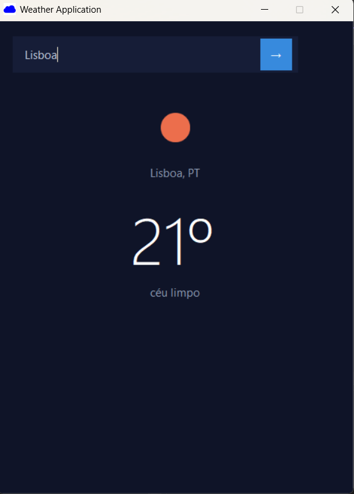

# ☁️ Weather Application

A clean and modern Windows Forms weather app built with C# and .NET Framework, powered by the OpenWeatherMap API.



---

## ✨ Features

- Search weather by city name
- Displays current temperature, city, country and weather description
- Weather icon loaded directly from OpenWeatherMap
- Clean dark UI built with pure WinForms (no external UI libraries)
- Press **Enter** or click **→** to search

---

## 🚀 Getting Started

### Prerequisites

- Visual Studio 2019 or later
- .NET Framework 4.7.2 or later
- A free [OpenWeatherMap API key](https://openweathermap.org/api)

### Installation

1. Clone the repository
   ```bash
   git clone https://github.com/GuilhermeDuarteB/WeatherFormsApplication.git
   ```

2. Open `WeatherAppForms.slnx` in Visual Studio

3. Install NuGet dependencies
   - Right-click the solution → **Restore NuGet Packages**
   - Required package: `Newtonsoft.Json`

4. Add your API key

   > ⚠️ **You must add your own API key before running the project.**
   >
   > In `Form1.cs`, find this line and replace `API_KEY_HERE` with your key:
   >
   > ```csharp
   > string apiKey = "API_KEY_HERE";
   > ```
   >
   > Get a free key at [openweathermap.org/api](https://openweathermap.org/api) — the free tier is enough for this project.

5. Run the project with **F5** or **Debug → Start Debugging**

---

## 🛠️ Built With

| Technology | Purpose |
|---|---|
| C# / .NET Framework | Core language and runtime |
| Windows Forms | UI framework |
| OpenWeatherMap API | Weather data |
| Newtonsoft.Json | JSON parsing |
| System.Net.Http | HTTP requests |

---

## 📁 Project Structure

```
WeatherAppForms/
├── Form1.cs              ← Main logic and event handlers
├── Form1.Designer.cs     ← Auto-generated UI layout
├── Program.cs            ← App entry point
├── App.config            ← App configuration
├── Resources/            ← Icons and images
└── packages.config       ← NuGet dependencies
```

---

## 🔑 API Key Security

This project uses the OpenWeatherMap API. The API key is **not** included in the repository for security reasons.

To run the project locally:
1. Register at [openweathermap.org](https://openweathermap.org) (free)
2. Go to **API Keys** in your account dashboard
3. Copy your key and paste it in `Form1.cs` where it says `API_KEY_HERE`

> For a more secure approach, consider storing the key in `App.config` using `ConfigurationManager.AppSettings` so it never touches the source code.

---

## 📸 Preview

The app features a minimal dark theme with centered weather information and a subtle search bar that blends with the background.

---

## 📄 License

This project is open source and available under the [MIT License](LICENSE).